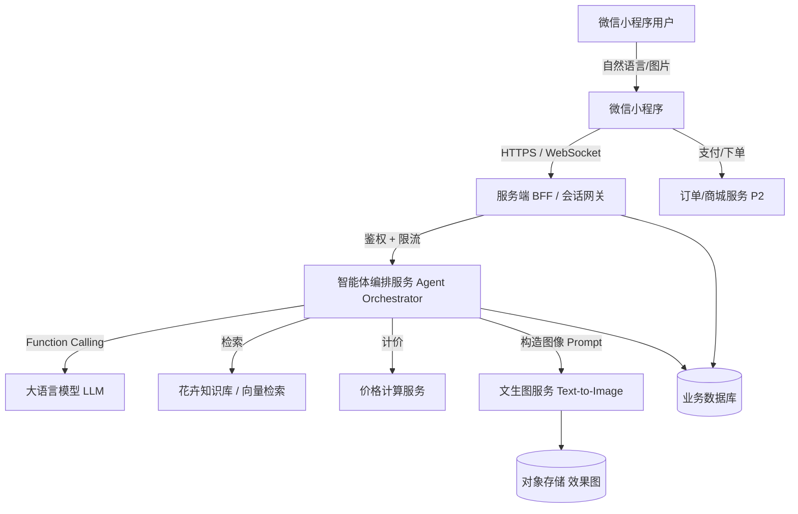
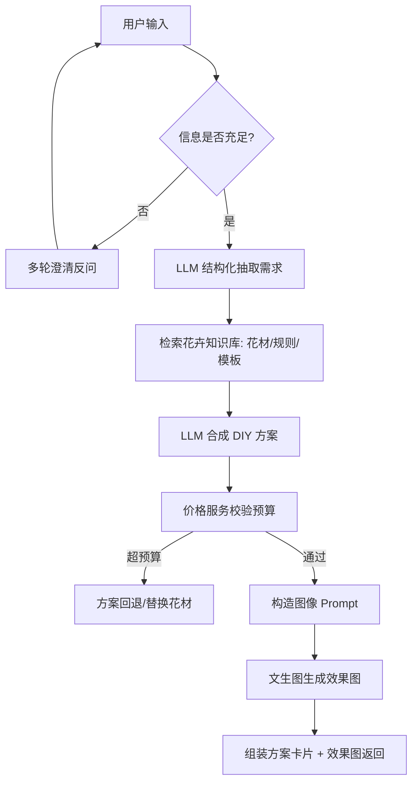
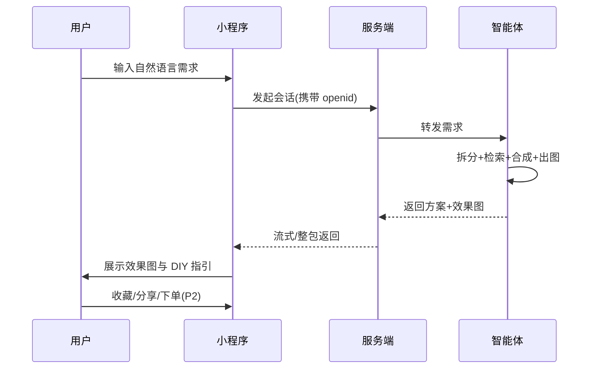

# 智能花卉 DIY 推荐智能体 · 工程文档

> 版本：v0.1（初稿）
> 最后更新：2026-08-03
> 状态：设计阶段 / 待评审

---

## 目录

1. [项目概述](#1-项目概述)
2. [需求分析](#2-需求分析)
3. [系统总体架构](#3-系统总体架构)
4. [智能体设计](#4-智能体设计)
5. [花卉 DIY 产品模型](#5-花卉-diy-产品模型)
6. [效果图生成](#6-效果图生成)
7. [微信小程序设计](#7-微信小程序设计)
8. [数据模型](#8-数据模型)
9. [接口设计](#9-接口设计)
10. [技术选型](#10-技术选型)
11. [开发计划与里程碑](#11-开发计划与里程碑)
12. [测试方案](#12-测试方案)
13. [风险与应对](#13-风险与应对)
14. [成本估算](#14-成本估算)
15. [附录](#15-附录)

---

## 1. 项目概述

### 1.1 项目背景

鲜花/花卉 DIY 正从小众兴趣走向大众消费，但普通用户在「想要一束符合心意的花」与「真正动手做出这束花」之间存在巨大鸿沟：

- 用户往往只能用模糊的自然语言描述需求（"给我妈做个温柔点的生日花束"），无法转化为具体花材、配色与结构；
- 市面花店/电商以成品售卖为主，缺乏"按我的想法定制 + 教我怎么做"的体验；
- 用户在购买前看不到"做出来长什么样"，决策成本高。

### 1.2 项目目标

构建一个**部署在微信小程序上的智能体**，核心能力是：

1. **理解**：接收用户自然语言需求，拆解出结构化要素（场景、对象、风格、预算、色彩、禁忌、尺寸等）；
2. **生成方案**：基于花卉知识库与搭配规则，给出一个完整、可落地的花卉 DIY 产品方案（花材清单 + 数量 + 价格 + 步骤）；
3. **生成效果图**：根据方案自动构造提示词，调用文生图模型产出一张对应效果图，用于展示与对照完成 DIY；
4. **闭环交付**：在小程序内完成"对话 → 方案 → 效果图 → 购买/收藏/分享"的完整体验。

### 1.3 核心价值

| 角色 | 价值 |
| --- | --- |
| 终端用户 | 用"说人话"的方式获得专属花艺方案与可视化效果，降低 DIY 门槛 |
| 商家/平台 | 提升转化（先看效果再买）、沉淀个性化方案资产、带动花材销售 |
| 运营 | 积累需求-方案-图像数据，反哺推荐与选品 |

### 1.4 名词定义

- **需求拆分（Requirement Decomposition）**：将自然语言映射为结构化字段的过程。
- **DIY 方案（DIY Plan）**：包含花材清单、结构、步骤、价格的完整可制作方案。
- **效果图（Render / Effect Image）**：基于方案文生图得到的预览图。
- **智能体（Agent）**：以 LLM 为核心、可调取工具（检索/计价/绘图）的多步推理系统。

---

## 2. 需求分析

### 2.1 用户场景

> 用户在微信小程序中输入：*"想给我妈做个生日花束，她喜欢淡紫色，温柔一点，不要玫瑰，预算 150 左右，放在客厅茶几上。"*

期望输出：

- 结构化理解：生日送礼 / 母亲 / 温柔淡雅 / 淡紫 / 禁玫瑰 / 预算~150 / 茶几摆放（中等尺寸+花器）；
- 推荐方案：以紫罗兰、淡紫绣球、洋桔梗为主，配尤加利叶，淡紫包装；
- 效果图：一张温馨淡紫生日花束的预览图；
- DIY 指引：花材清单、数量、绑扎步骤、预计耗时。

### 2.2 功能需求（FR）

| 编号 | 功能 | 说明 | 优先级 |
| --- | --- | --- | --- |
| FR1 | 自然语言理解 / 需求拆分 | 将输入映射为结构化需求字段 | P0 |
| FR2 | 花卉 DIY 方案生成 | 输出花材清单、结构、步骤、价格 | P0 |
| FR3 | 效果图生成 | 文生图生成方案预览 | P0 |
| FR4 | 方案展示与 DIY 指引 | 卡片化展示 + 步骤教学 | P0 |
| FR5 | 多轮对话澄清 | 信息不足时反问（预算/风格/对象） | P1 |
| FR6 | 收藏 / 历史 / 分享 | 保存方案、分享给好友 | P1 |
| FR7 | 花材购买 / 下单 | 一键购齐花材或导出清单 | P2 |
| FR8 | 风格/场景模板 | 提供节日、送礼等快捷入口 | P2 |

### 2.3 非功能需求（NFR）

| 类别 | 要求 |
| --- | --- |
| 性能 | 一次"理解+方案"≤ 5s；"理解+方案+出图"端到端 ≤ 20s |
| 可用性 | 小程序首屏 ≤ 1.5s；核心链路可用率 ≥ 99% |
| 成本 | 单次对话 LLM 成本可控（≤ 数分钱级）；出图成本单张可控 |
| 安全 | 不收集无关隐私；图像内容合规过滤；防 Prompt 注入 |
| 可扩展 | 花材库/规则可运营配置，无需发版即可上新 |

### 2.4 用户故事（节选）

- 作为**送礼用户**，我希望用一句话描述收礼人和心意，以便快速获得合适的花束方案。
- 作为**新手 DIYer**，我希望看到效果图和步骤，以便照着做不翻车。
- 作为**预算敏感用户**，我希望方案给出明确价格，以便在预算内选择。

---

## 3. 系统总体架构

### 3.1 架构图



### 3.2 分层说明

1. **端（微信小程序）**：对话输入、方案与效果图展示、DIY 步骤、收藏分享。
2. **接入层（BFF / 会话网关）**：微信登录鉴权、会话管理、限流、协议转换。
3. **智能体核心（Agent Orchestrator）**：多步推理，调度 LLM 与各类工具。
4. **能力层**：
   - LLM：中文意图理解与结构化抽取；
   - 知识库：花材属性、搭配规则、节日/场景模板（向量 + 结构化）；
   - 价格服务：基于花材库实时计价；
   - 文生图：将方案转为图像 Prompt 并出图。
5. **数据层**：业务库（用户/会话/方案/订单）、对象存储（图像）、知识库索引。

---

## 4. 智能体设计

### 4.1 角色定义（System Prompt 要点）

> 你是一名资深花艺师兼 DIY 指导顾问。你的任务是：把用户的自然语言需求，拆解为结构化要素；基于花卉知识库给出**可制作、在预算内、符合审美**的 DIY 方案；并输出用于生成效果图的英文图像提示词。禁止编造不存在的花材；预算超限时必须主动调整。

### 4.2 需求拆分维度（结构化字段 Schema）

```json
{
  "intent": "生日送礼 | 家居装饰 | 纪念 | 节日 | 其他",
  "recipient": "母亲/恋人/朋友/自己/同事 ...",
  "occasion": "生日/母亲节/婚礼/探病/乔迁 ...",
  "style": ["温柔","淡雅","热烈","复古","极简","田园" ...],
  "color_tone": ["淡紫","莫兰迪","暖橘","纯白" ...],
  "budget": 150,
  "category": "花束 | 瓶花 | 花盒 | 胸花 | 手捧",
  "size": "小型/中型/大型（由摆放位置推导）",
  "forbidden": ["玫瑰","花粉过敏" ...],
  "preferred": ["绣球","洋桔梗" ...],
  "placement": "客厅茶几/卧室/办公桌/送礼携带",
  "extras": ["需要花器","可持久(仿真/干花)"]
}
```

### 4.3 处理流程



### 4.4 关键 Prompt 设计

**结构化抽取 Prompt（节选）**

```
请从用户需求中抽取以下字段并以 JSON 返回，缺失且必要则置 null：
intent, recipient, occasion, style[], color_tone[], budget, category,
size, forbidden[], preferred[], placement, extras[]。
仅输出 JSON，不要解释。
```

**方案合成 Prompt（节选）**

```
基于需求字段与检索到的花材库，给出 DIY 方案：
1) 主花/配花/叶材及数量；
2) 配色与包装；
3) 结构（如"螺旋绑扎，外圈尤加利"）；
4) 步骤（3-6 步）；
5) 预算拆解。
约束：禁止 forbidden 花材；总价 <= budget；花材必须来自检索结果。
```

**图像 Prompt 构造规则**

- 由 style + color_tone + category + 花材名 拼装；
- 固定质量词："photorealistic, soft studio lighting, high detail, 8k"；
- 由 placement 决定背景（如茶几→"on a living room coffee table"）；
- 中文需求 → 翻译为英文 Prompt（LLM 负责翻译）。

### 4.5 工具定义（Function Calling）

| 工具 | 作用 | 入参 | 出参 |
| --- | --- | --- | --- |
| `search_flowers` | 按风格/色彩/禁忌检索花材 | style, color, forbidden | 花材列表(属性/价格/季节) |
| `calc_price` | 按清单计价并校验预算 | items[] | 总价 + 是否超限 |
| `generate_image` | 文生图 | prompt, ratio, style_ref | 图像 URL |
| `get_template` | 拉取节日/场景模板 | occasion | 推荐组合 |

---

## 5. 花卉 DIY 产品模型

### 5.1 方案（Plan）数据结构

```json
{
  "plan_id": "pln_xxx",
  "requirements": { "...": "见 4.2" },
  "items": [
    { "flower_id": "f_lisianthus", "role": "主花", "qty": 5, "unit": "支" }
  ],
  "package": "淡紫雾面包装纸 + 麻绳",
  "structure": "螺旋绑扎，外圈尤加利叶",
  "steps": ["修叶去刺", "螺旋排列", "定点绑扎", "包装", "修剪定型"],
  "price_breakdown": { "flowers": 120, "package": 20, "tools": 10, "total": 150 },
  "image_prompt": "A soft lavender birthday bouquet ...",
  "render_url": "https://cdn/.../pln_xxx.png",
  "diy_minutes": 25
}
```

### 5.2 花材库（Flower Material）核心字段

| 字段 | 说明 |
| --- | --- |
| flower_id / name | 标识与名称（中/英/拉丁） |
| category | 主花/配花/叶材/填充 |
| colors | 可选色系 |
| season | 当季/全年 |
| price_per_unit | 单位价格 |
| properties | 花语、花期、是否易过敏 |
| style_tags | 适配风格 |

### 5.3 搭配规则（Compatibility Rules）

- 色彩协调：同色系 / 邻近色优先，撞色需明确意图；
- 形态平衡：主花体量 × 数量 与 配花/叶材 比例；
- 禁忌：过敏花材（如百合花粉）对"探病/母婴"场景降权；
- 季节：非当季花材标注"需预订/价高"。

### 5.4 价格模型

```
总价 = Σ(花材单价 × 数量) + 包装 + 工具/辅材
约束：总价 <= budget；若超限，按比例降级配花或替换高价主花。
```

---

## 6. 效果图生成

### 6.1 方案

- **主方案**：调用文生图 API（服务端），输入由 4.4 构造的英文 Prompt；
- **风格一致性**：可选传入风格参考图（Reference / ControlNet）保证与品牌调性统一；
- **尺寸**：默认 3:4（竖版，适合手机与花束构图），可选 1:1。

### 6.2 Prompt 模板（示例）

```
A soft, elegant birthday flower bouquet in lavender and pale purple tones,
featuring lisianthus, hydrangea and violet, wrapped in lavender paper with twine,
gentle romantic style, soft studio lighting, placed on a living room coffee table,
photorealistic, high detail, 8k.
```

### 6.3 输出与合规

- 输出规格：PNG/JPG，≥ 1024×1024，CDN 存储并返回 URL；
- 内容安全：图像生成前做合规校验，禁止违规内容；
- 失败兜底：出图失败时返回"方案卡片 + 占位图 + 重试"，不影响核心方案交付。

### 6.4 成本控制

- 缓存：相同 (需求签名) 命中缓存直接复用图像；
- 降频：多轮对话中未变更方案不重复出图；
- 模型分级：草稿用低成本模型，精修用高质量模型。

---

## 7. 微信小程序设计

### 7.1 页面结构

| 页面 | 作用 |
| --- | --- |
| `pages/index` | 首页：场景/风格快捷入口 + 对话入口 |
| `pages/chat` | 对话页：输入需求、多轮澄清、流式展示 |
| `pages/plan` | 方案详情：效果图 + 花材清单 + 步骤 + 价格 |
| `pages/mine` | 我的：历史 / 收藏 / 设置 |
| `pages/order`（P2） | 下单购齐花材 |

### 7.2 用户流程



### 7.3 关键技术点

- **登录**：`wx.login` 拿 code → 服务端换 `openid`（UnionID 如需跨端）；
- **实时性**：方案文本用流式（SSE/WebSocket），图像异步回传；
- **图像**：小程序内 `<image>` 展示 CDN 图，支持保存到相册；
- **后端**：推荐**微信云开发 CloudBase**（云函数 + 云数据库 + 云存储），与小程序同生态、免运维；也可自建 Node 服务。

---

## 8. 数据模型

| 表 | 关键字段 | 说明 |
| --- | --- | --- |
| user | openid, nick, created_at | 用户 |
| session | session_id, openid, status | 对话会话 |
| message | msg_id, session_id, role, content | 对话消息 |
| plan | plan_id, session_id, requirements, items, price, render_url | 方案 |
| flower | flower_id, name, category, colors, price, season, style_tags | 花材库 |
| rule | rule_id, type, condition, action | 搭配/计价规则 |
| order（P2） | order_id, openid, plan_id, amount, status | 订单 |

---

## 9. 接口设计

### 9.1 会话 / 生成

```
POST /api/v1/chat
Req:  { openid, session_id?, message }
Resp: { session_id, reply_text, plan?, render_url?, need_clarify? }
```

### 9.2 方案详情

```
GET /api/v1/plan/:plan_id
Resp: { plan_id, requirements, items, steps, price_breakdown, render_url }
```

### 9.3 图像回调（异步）

```
POST /api/v1/render/callback
Req:  { plan_id, image_url, status }
```

> 说明：出图为异步，服务端生成后通过回调/推送更新小程序页面。

---

## 10. 技术选型

| 层 | 推荐 | 备选 | 说明 |
| --- | --- | --- | --- |
| LLM | 腾讯混元 / DeepSeek / 通义千问 | GPT-4o（成本高） | 中文理解好、成本低 |
| 文生图 | 腾讯云 AI 绘画 / 开源 SD+ControlNet | 即梦/可灵等 | 服务端调用，可控合规 |
| 小程序 | 微信原生 / Taro / uni-app | — | 原生最稳，Taro 跨端 |
| 后端 | 微信云开发 CloudBase（推荐） | 自建 Node(NestJS) | 云开发省运维 |
| 数据库 | 云开发云数据库 / MongoDB | PostgreSQL | 文档型契合方案结构 |
| 检索 | 向量库（如 pgvector / 腾讯云向量） | 全文检索 | 花材语义检索 |
| 存储 | 云存储 / 对象存储 COS | — | 效果图 |

---

## 11. 开发计划与里程碑

| 阶段 | 周期(估) | 交付 |
| --- | --- | --- |
| M0 需求与方案评审 | 1 周 | 本文档定稿 |
| M1 智能体内核 | 2 周 | 需求拆分 + 方案生成（无图） |
| M2 效果图生成 | 1.5 周 | 文生图接入 + Prompt 调优 |
| M3 小程序 MVP | 2 周 | 对话/方案/效果图展示 |
| M4 打磨与上线 | 1.5 周 | 收藏/分享、性能与成本优化 |
| M5（P2）电商闭环 | 2 周 | 下单购齐花材 |

---

## 12. 测试方案

- **单元**：需求拆分 JSON  Schema 校验、价格计算；
- **集成**：端到端"输入→方案→出图"链路；
- **效果评估**：随机抽取 50 条需求，人工评分方案合理性与图像贴合度（目标 ≥ 4/5）；
- **性能**：P95 出图时延、并发压测；
- **安全**：Prompt 注入、图像合规、越权访问。

---

## 13. 风险与应对

| 风险 | 影响 | 应对 |
| --- | --- | --- |
| 文生图与方案不符 | 体验差 | 强约束 Prompt + 花材名直写 + 风格参考图 |
| 出图时延高/成本高 | 转化低 | 缓存、异步、模型分级 |
| LLM 幻觉（编造花材） | 不可制作 | 强制检索 + 校验花材库 |
| 预算控制失效 | 超支 | 价格服务回退循环 |
| 微信审核/合规 | 上架风险 | 内容过滤、隐私最小化 |

---

## 14. 成本估算（量级参考）

- **LLM**：单次对话约数千 token，成本在"分"级；
- **文生图**：单张成本取决于模型，建议缓存命中降本；
- **基础设施**：云开发按量计费，MVP 阶段成本低；
- **人工**：花材库与搭配规则的初始建设是一次性投入。

> 注：具体单价需按所选厂商报价填入，本文档给出结构而非报价。

---

## 15. 附录

### 15.1 关键假设（待确认）

1. 文生图采用**服务端调用**第三方/自建模型（小程序无法本地跑）；
2. 后端优先采用**微信云开发**，如需对接现有电商系统可改为自建；
3. 首期聚焦**花束/瓶花/花盒**三类，胸花/手捧后续扩展；
4. 商城/下单为 P2，MVP 先交付"对话+方案+效果图"。

### 15.2 待决策项

- [ ] LLM 与文生图最终供应商；
- [ ] 是否接入真实花材供应链（影响下单能力）；
- [ ] 风格参考图资产由谁提供；
- [ ] 是否需要多语言（繁体/英文）支持。

### 15.3 文档维护

- 本文档随需求/技术评审同步更新；
- 重大变更需登记版本号与变更说明。

---

*文档结束。如需补充「详细 Prompt 全集」「数据库 DDL」「小程序代码骨架」或转成 Word/PDF，可在此基础上继续扩展。*
